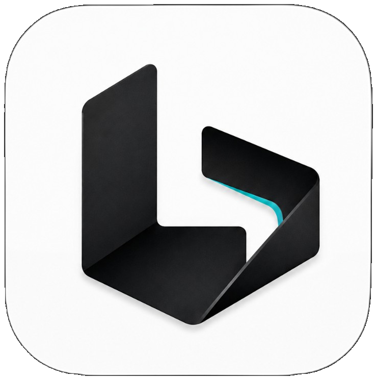

<p align="center">
  
</p>

<h1 align="center">灵动 Code · Lingdong Code</h1>

<p align="center">
  <strong>开源的桌面 AI 编程 Agent</strong><br/>
  让 AI 真正进入你的项目：理解代码、制定计划、修改文件、执行命令，并把每一步变化清楚地呈现出来。
</p>

<p align="center">
  <a href="LICENSE"></a>
  
  
  
  
</p>

<p align="center">
  <a href="#-快速开始">快速开始</a>
  ·
  <a href="docs/灵动Code%20使用手册.md">使用手册</a>
  ·
  <a href="docs/功能能力清单.md">能力清单</a>
  ·
  <a href="docs/给大模型的构建与%20DIY%20指南.md">AI 构建指南</a>
  ·
  <a href="https://github.com/LingdongLab/lingdong-code/releases">Releases</a>
</p>

---

## 灵动 Code 是什么？

灵动 Code 是一个面向真实项目工作的 **AI Coding Agent 桌面端**。

它不是只在编辑器旁边放一个聊天框。

你可以直接打开一个代码仓库，然后告诉它：

> 帮我分析这个项目的登录流程，先给出修改计划，确认后再开始改。

灵动 Code 会围绕这个目标完成一整套工作：

**理解仓库 → 建立上下文 → 制定 Plan → 调用工具 → 修改代码 → 执行命令 → 跟踪任务 → 展示 Diff → 审阅 / 回退**

你看到的不只是最后一句 AI 回复，而是整个 Agent 的工作过程。

---

## ✨ 核心能力

### 01 · 五种工作模式

灵动 Code 提供：

- **Ask** — 阅读代码、解释项目、回答问题，不直接修改
- **Plan** — 调研仓库并生成结构化实施计划
- **Agent** — 修改文件、运行命令、完成完整开发任务
- **Auto** — 自动放行低风险操作，让长任务更连续
- **Debug** — 收集诊断信息，再进入修复流程

同一个项目，可以根据任务风险和复杂度自由切换。

### 02 · 真正可执行的 Plan

Plan 不只是模型输出的一段 Markdown。

灵动 Code 会把计划变成可以继续执行的工作对象：

- 结构化步骤
- 涉及文件
- 风险与澄清问题
- 拖拽调整步骤顺序
- 增删、修改计划
- 批准后直接进入 Agent 执行
- 暂停 / 继续
- 执行状态同步
- 导出 Markdown

**先想清楚，再动代码。**

### 03 · Agent 工作时间线

文件读取、代码修改、命令执行、工具调用和任务状态都会进入统一时间线。

你可以看到 AI：

- 正在分析什么
- 调用了什么工具
- 修改了哪些文件
- 命令是否执行成功
- 当前任务进行到哪一步
- 哪里需要你的授权或回答

复杂任务不再只有一个不断刷新的聊天气泡。

### 04 · Changes / Diff / 快照回退

Agent 修改项目后，可以按轮次查看变更：

- Create / Modify / Delete / Rename
- `+N / -N` 行数统计
- 单文件接受 / 拒绝
- 整轮接受 / 拒绝
- 打开 Diff
- 冲突状态
- 撤销本轮修改

文件写入前会创建本地快照，降低 AI 改错代码后的恢复成本。

### 05 · 仓库与会话

灵动 Code 将 **Agent 仓库** 与普通编辑器工作区解耦。

支持：

- 添加 / 切换项目
- 无需重启窗口
- 会话按仓库独立保存
- 新建 / 固定 / 归档 / 重命名 / 删除 / 搜索会话
- 切回仓库后继续之前的上下文

适合同时维护多个真实项目，而不是一次性 Demo。

### 06 · 灵活的上下文系统

可以把真正相关的信息交给 Agent，而不是把整个项目一股脑塞进模型。

支持：

- `@` 文件
- 代码选区
- 文件夹
- 终端输出
- Problems / Diagnostics
- 图片
- 当前文件与多文件上下文

同时对工作区范围、文件大小、敏感路径和凭据内容进行限制与脱敏。

### 07 · 多模型 / 多服务商

当前支持：

- **DeepSeek**
- **Poe**
- **自定义 OpenAI 兼容服务**

协议层支持多种常见接口形式，并提供：

- Provider 管理
- 模型列表
- API Key 管理
- 连接测试
- 模型能力探测
- 模型切换保护

你不需要把整个产品绑定在单一模型上。

### 08 · Skills 与 MCP

灵动 Code 已提供 Skills 与 MCP 的扩展入口。

你可以：

- 管理 Skills
- 添加自己的 MCP Server
- 启用 / 停用 MCP
- 配置 MCP 凭据
- 让 Agent 获得更多外部工具能力

同时内置 WebSearch / WebFetch 能力供 Agent 在需要时使用。

### 09 · 权限与风险控制

Agent 能执行命令，也意味着权限必须可见、可控。

灵动 Code 对操作进行风险分级，并提供：

- **均衡**
- **严格**
- **放行**

三种审批力度。

敏感操作会出现明确的权限卡片，你可以：

- 仅允许一次
- 本会话允许
- 以后允许
- 拒绝

越界访问、凭据读取以及部分高风险系统命令不会被自动放行。

---

## 🖥️ 两种界面形态

### Agent 模式

以 AI 工作流为中心。

对话、计划、任务、变更和上下文组成主要工作区，更适合直接把开发任务交给 Agent。

### IDE 模式

保留熟悉的编辑器、资源管理器和工作区体验，同时使用灵动 Agent。

你可以在 **AI Agent 工作台** 和 **传统 IDE** 之间切换，而不是二选一。

---

## 🧩 工作台

主面板提供可切换的工作轨道：

| 工作台 | 用途 |
|---|---|
| **Changes** | 查看本轮代码变化与 Diff |
| **Files** | 浏览当前仓库文件 |
| **Tasks** | 查看任务与执行状态 |
| **Context** | 管理当前上下文 |
| **Plan** | 查看与编辑实施计划 |
| **Browser** | 调用浏览器相关能力 |
| **Terminal** | 打开并使用终端 |

---

## 🤖 一个典型工作流

```text
打开项目
   ↓
Ask：先了解代码和需求
   ↓
Plan：生成实施方案
   ↓
你审阅 / 修改 / 批准
   ↓
Agent：开始执行
   ↓
读取文件 / 修改代码 / 运行命令
   ↓
Tasks + Timeline 持续更新
   ↓
Changes / Diff 检查结果
   ↓
接受修改 或 回退
```

目标不是让 AI “回答得像会编程”。

而是让它 **真正进入工程流程**。

---

## 🚀 快速开始

### 方式一：使用发行版

前往：

**[GitHub Releases](https://github.com/LingdongLab/lingdong-code/releases)**

下载对应版本的 Windows 发行包，解压或安装后即可启动。

首次使用：

1. 打开一个项目文件夹
2. 进入灵动 Agent 的模型设置
3. 配置至少一个模型服务
4. 新建会话
5. 开始把真实任务交给 Agent

> 如果当前版本暂未提供 Release 附件，请使用下面的源码构建方式。

更详细的操作说明：

**[灵动 Code 使用手册](docs/灵动Code%20使用手册.md)**

---

## 🛠️ 从源码构建

### 环境要求

- Windows 10 / 11 x64
- Node.js 20+
- Python 3.10+
- Git
- Visual Studio Build Tools（Desktop development with C++）
- 建议预留 40GB+ 可用磁盘空间

### 1. 克隆仓库

```powershell
git clone https://github.com/LingdongLab/lingdong-code.git
cd lingdong-code
```

### 2. 安装项目依赖

```powershell
npm install
```

### 3. 准备 Code-OSS

```powershell
powershell -NoProfile -File desktop\scripts\setup-vscode.ps1
```

### 4. 同步灵动 Code 品牌与内置扩展

```powershell
powershell -NoProfile -File desktop\scripts\sync-all.ps1
```

### 5. 获取 Grok Build Runtime

```powershell
powershell -NoProfile -File scripts\fetch-grok.ps1 -InstallOfficial -Force
```

### 6. 编译 Windows 桌面端

```powershell
powershell -NoProfile -File desktop\scripts\build-win32.ps1
```

### 7. 打包绿色版

```powershell
powershell -ExecutionPolicy Bypass -File packaging\build-portable.ps1
```

构建说明、环境检查和常见问题请查看：

**[Code-OSS 构建说明](docs/code-oss-build.md)**

如果你准备直接让 Cursor / Codex / ChatGPT 等 AI 助手帮你完成构建或二次开发：

**[给大模型的构建与 DIY 指南](docs/给大模型的构建与%20DIY%20指南.md)**

---

## 🏗️ 项目结构

```text
lingdong-code/
├─ vscode-extension/
│  └─ lingdong-agent/         # Agent UI 与产品编排
│
├─ packages/
│  └─ agent-runtime/          # ACP / Agent Runtime 封装
│
├─ desktop/
│  ├─ product/                # 产品配置
│  ├─ patches/                # 桌面壳补丁
│  └─ scripts/                # Code-OSS 准备 / 同步 / 构建脚本
│
├─ packaging/                 # Windows 打包与品牌资源
├─ grok/                      # 本地 Runtime 目录（大文件不进入 Git）
├─ scripts/                   # Runtime 获取等工具脚本
├─ docs/                      # 文档
│
├─ LICENSE
├─ THIRD_PARTY_NOTICES.md
└─ README.md
```

---

## ⚙️ 架构

```text
┌──────────────────────────────────────────────┐
│                 Lingdong Code                │
│                                              │
│  Code-OSS Desktop Host                       │
│        │                                     │
│        ├── Lingdong Agent                    │
│        │    ├── Composer / Timeline          │
│        │    ├── Plan / Tasks                 │
│        │    ├── Changes / Context            │
│        │    ├── Skills / MCP                 │
│        │    └── Model Center                 │
│        │                                     │
│        └── @lingdong/agent-runtime           │
│                 │                            │
│                 │ ACP / JSON-RPC             │
│                 ▼                            │
│             Grok Build Runtime               │
│                 │                            │
│                 ▼                            │
│       Model Providers / Tools / MCP          │
└──────────────────────────────────────────────┘
```

---

## 🔐 隐私与安全

灵动 Code 尽量把 Agent 的权限和数据边界留在用户手里。

当前实现包括：

- API Key 使用 SecretStorage 保存，不写入普通配置 JSON
- 托管 Grok Home 默认关闭遥测、反馈、Trace / OTel 等上传能力
- 日志、错误和会话内容经过敏感信息脱敏
- Agent 上下文限制在当前活动仓库
- 凭据类路径与敏感内容会被过滤
- 文件修改前创建本地快照
- 高风险操作进入权限审批流程

> **注意：** 使用云端模型服务时，为完成模型推理，相关提示词与被选中的上下文仍会发送到你配置的模型服务商。请根据项目的保密要求选择合适的模型与 Provider。

任何 API Key、Token、账号密码都不要提交到 Git，也不要贴到公开 Issue。

---

## 📚 文档

| 文档 | 用途 |
|---|---|
| [灵动 Code 使用手册](docs/灵动Code%20使用手册.md) | 安装后怎么使用 |
| [功能能力清单](docs/功能能力清单.md) | 查看当前已经实现的完整能力 |
| [给大模型的构建与 DIY 指南](docs/给大模型的构建与%20DIY%20指南.md) | 让 AI 帮你编译、修改、二开 |
| [Code-OSS 构建说明](docs/code-oss-build.md) | 环境配置、完整编译、踩坑 |
| [Code-OSS 源码改造指南](docs/Code-OSS%20源码改造指南.md) | 修改桌面壳、菜单、布局等 |
| [Grok 源码构建](docs/grok-源码构建.md) | 自行构建 Runtime |
| [第三方声明](THIRD_PARTY_NOTICES.md) | 第三方组件与许可证 |

---

## 🧱 技术基础与开源说明

灵动 Code 自身仓库代码采用 **MIT License**。

项目构建与运行还涉及第三方开源项目，包括：

- **Microsoft VS Code / Code-OSS** — MIT License
- **xAI Grok Build** — Apache License 2.0

`grok.exe` 不直接提交到本仓库，构建脚本会按项目约定获取对应 Runtime。

如果你准备重新分发修改后的 Lingdong Code，请同时阅读：

**[THIRD_PARTY_NOTICES.md](THIRD_PARTY_NOTICES.md)**

并遵守相关第三方项目的许可证要求。

---

## ⚠️ 当前边界

灵动 Code 仍处于早期版本。

当前需要知道的限制包括：

- 主要支持 Windows x64
- Preview 工作台暂未启用
- 暂无跨仓库全局会话搜索
- 当前发行包可能没有代码签名
- 暂无自动更新服务
- 未信任工作区不启用 Agent
- Debug 当前属于灵动 Code 的本地编排模式

我们更愿意明确告诉你“现在有什么”，而不是把尚未完成的入口包装成已经可用的功能。

---

## 🤝 Contributing

欢迎参与灵动 Code。

你可以：

- 提交 Bug
- 提出产品建议
- 完善文档
- 改进 UI
- 优化 Agent 工作流
- 改进打包与构建脚本
- 提交 Pull Request

提交代码前，请确保：

1. 不包含 API Key、Token、账号信息等敏感数据
2. 不提交本机绝对路径或大型构建产物
3. Agent 相关修改尽量运行现有测试
4. 改动构建流程时同步更新相关文档

---

## ❤️ 为什么开源？

AI 编程工具正在快速变化。

模型会变，接口会变，Agent Runtime 会变，IDE 也会变。

我们更希望把 **“AI 如何真正参与软件开发”** 这件事做成一个可以被看见、修改和继续创造的开放工程。

灵动 Code 还很早。

如果它对你有帮助，欢迎：

**Star · Issue · PR · Fork**

一起把它做得更好。

---

<p align="center">
  <strong>Lingdong Code</strong><br/>
  Build with AI. Keep control.
</p>
