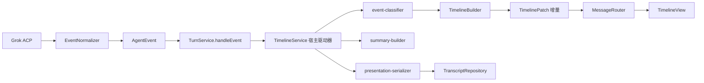

# 阶段 G-R5：Agent 事件呈现系统与任务时间线

完成日期：2026-08-05

本阶段把 Grok Build / ACP 返回的原始工具事件，转换成面向普通用户的任务时间线。
核心不是改 CSS，而是在宿主端建立一层纯数据的 Presentation：

原始事件 → 事件标准化 → 活动分类 → 活动分组 → 真实统计 → Timeline UI

---

## 一、当前测试基线

| 项目 | 阶段前 | 阶段后 |
| --- | --- | --- |
| 扩展测试 | 296（其中 1 项失败） | 356 / 356 通过 |
| Runtime 测试 | 75 / 75 | 75 / 75 通过 |
| 合计 | 371 | 431 |
| typecheck | 通过 | 通过 |
| build | 通过 | 通过 |

阶段前那 1 项失败是 `tests/event-presenter.test.ts` 里断言 `EventPresenter` 产出
`toolStarted` / `toolStatus` 的用例。工具呈现改由时间线统一负责后，该断言与新架构直接冲突，
已改写为断言新契约（详见第八节），并补了一项「未知形态工具事件仍能被分类成可读动作」，
覆盖原用例真正关心的问题。没有删除或跳过任何其他既有用例。

---

## 二、Presentation 架构



`src/presentation/` 是纯数据层，不 import DOM、Webview 与 VS Code API，可直接单测：

| 文件 | 行数 | 职责 |
| --- | --- | --- |
| `turn-presentation.ts` | 54 | 轮次模型、状态文案、耗时格式化 |
| `activity-group.ts` | 135 | 分组模型、固定主标题、组摘要统计 |
| `activity-item.ts` | 72 | 条目模型、面向用户的动词 |
| `turn-summary.ts` | 54 | 统计模型与结算文案 |
| `event-classifier.ts` | 101 | 原始工具事件 → 归一化活动 |
| `timeline-builder.ts` | 232 | 合并、分组、状态机、增量补丁 |
| `verification-parser.ts` | 133 | 验证输出保守解析 |
| `summary-builder.ts` | 58 | 真实统计结算 |
| `presentation-serializer.ts` | 218 | 序列化、校验、脱敏、重启中断修复 |

与 Runtime 的关系：Presentation 层只消费 `AgentEvent`，不修改任何原始事件。

需要说明的同名文件：新增的 `src/presentation/turn-summary.ts` 负责时间线底部的数量统计，
既有的 `src/turn-summary.ts` 负责 `stopReason` 的收尾文案。同名不同职，互不引用。

---

## 三、数据结构

```ts
type TurnStatus = "running" | "completed" | "failed" | "stopped" | "interrupted";

interface TurnPresentation {
  sessionId: string;
  turnId: string;
  status: TurnStatus;
  startedAt: number;
  completedAt?: number;
  durationMs?: number;
  groups: ActivityGroup[];
  summary?: TurnSummary;
  retried?: boolean;      // 用户重试后给旧时间线打的标记
}

type ActivityGroupKind =
  | "exploration" | "editing" | "command" | "verification" | "warning" | "failure";

interface ActivityGroup {
  id: string;
  kind: ActivityGroupKind;
  title: string;          // 固定主标题，不允许模型自由生成
  subtitle?: string;      // 仅当已批准计划的当前步骤可明确映射时出现
  status: "running" | "completed" | "failed" | "stopped";
  startedAt: number;
  completedAt?: number;
  items: ActivityItem[];
}

interface ActivityItem {
  id: string;
  toolCallId: string;     // 合并身份的核心
  action: ActivityAction; // list/read/search/diagnostics/edit/create/delete/rename/run/test/typecheck/lint/build
  target?: string;        // 只存工作区相对路径或命令文本
  status: "running" | "completed" | "failed" | "stopped";
  startedAt: number;
  completedAt?: number;
  exitCode?: number;
  detail?: string;
}
```

推送增量时使用不含子节点的组头与轮次头，避免整块重绘：

- `TurnPresentationHeader = Omit<TurnPresentation, "groups">`
- `ActivityGroupHeader = Omit<ActivityGroup, "items">`

`TurnSummary` 的 `addedLines` / `deletedLines` 保留为可选字段，但本版本永不赋值，原因见第十六节。

---

## 四、事件分类规则

`classifyTool()` 消费 `tool_started` 的 `kind`（Runtime 的 `ToolDisplayKind`）、`name`、`label`、`target`，
输出 `{ toolCallId, action, target? }`。原始工具名只在这一处被消费，之后的层只认识 `ActivityAction`。

| 分组 | 归入的动作 | 固定主标题 |
| --- | --- | --- |
| exploration | list / read / search / diagnostics | 探索代码库 |
| editing | edit / create / delete / rename | 修改代码 |
| command | run | 执行命令 |
| verification | test / typecheck / lint / build | 验证结果 |
| warning / failure | 无对应工具调用的告警与失败 | 需要注意 / 任务失败（或断线专用标题） |

命令细分的判定顺序有意为之：`typecheck` 早于 `build`（`tsc -b` 两边都命中），
`lint` 早于 `test`（`test:lint` 之类）。

两条保护：

- `kind === "plan"` 的工具返回 `undefined`，不进时间线，计划由计划文档负责，不重复呈现。
- 兜底也必须给出确定动作：识别不出形态时按 `readOnly` 落到 `read` 或 `run`，
  绝不让真实活动静默消失。

正式界面不出现 `Read`、`List Files`、`Run Command`、`tool_started`、`tool_completed`。
原始事件名只留在 Output Channel。`tests/timeline-view.test.ts` 有一项专门扫描渲染结果中的这些字样。

绝对路径不进 UI：`toRelativeTarget()` 把工作区内路径压成 `src/auth/session.ts`，
工作区外或无法判定的绝对路径只保留末两段，不整条泄漏。

---

## 五、活动合并与分组规则

### 合并

合并身份是 `sessionId + turnId + toolCallId`，由 `TimelineBuilder.byTool` 索引。

一次工具调用依次产生的 `tool_started` / `command_output` / `tool_completed`
合并到同一个 `ActivityItem`：`started` 建条目，`command_output` 只累积到输出缓存供解析使用，
`tool_completed` 原地更新状态、退出码与失败详情。同一 `toolCallId` 重复上报 `started` 也只更新原条目。

`TimelineBuilder` 内没有任何按时间去重的逻辑，因此：

- 不同 `toolCallId` 不合并
- 不同文件不合并
- 不同命令不合并
- started / output / completed 不重复渲染

旧的「3 秒内文案相同」去重只保留在 `tool-aggregate.ts` 里，且只服务旧会话回退，
不再作用于真实工具事件。

### 分组

按 `ActivityGroupKind` 做相邻归并：kind 一变就封组。因此 `read → edit → read` 必然产生
探索代码库 / 修改代码 / 探索代码库 三组，不会为了少一张卡片错误合并。同类活动连续到达则继续留在同一组。

计划步骤只作副标题（`当前步骤：<步骤标题>`），且只在 `PlanFacade` 有 approved / executing 计划
且 `currentStepId` 能命中步骤时出现，永不替换固定主标题。

---

## 六、真实统计来源

| 统计 | 来源 | 规则 |
| --- | --- | --- |
| `filesRead` | ActivityItem 的唯一相对路径 | 同一文件读多次只算一个已查看文件 |
| `searches` | 真实 search `toolCallId` 数量 | 按调用计数，不按文案 |
| `commandsRun` | 真实 `run` `toolCallId` 数量 | 验证类命令不计入命令数 |
| `filesModified` / `Created` / `Deleted` | `ChangeFacade.countChanges(turnId)` | 只认 ChangeTracker 的 `changedFiles.kind`，不从工具事件推断 |
| `testsPassed` / `testsFailed` | `verification-parser` | 只在输出结构明确时给数字 |
| `verificationStatus` | 同上 | 拿不准一律 `unavailable` |
| 耗时 | 真实 `startedAt` / `completedAt` | 运行中说「已运行」，结束说「耗时」 |

`changeCounts` 返回 `undefined` 表示无法统计，而不是 0，界面因此不显示这一项而不是显示「修改 0 个文件」。

行数（`+N/-N`）本版本不显示：`turns.json` 只存路径、`kind` 与 SHA256，改前内容在 `agent-snapshots/`，
改后内容只在磁盘，仓库没有行级 diff 算法。没有可靠数据时只显示「修改了 N 个文件」，绝不猜测。

验证输出解析支持 node:test（TAP `# pass` / `# fail`）、vitest、jest、mocha、pytest、
TypeScript typecheck、build、lint。解析保守：

- 数字明确时以数字为准，退出码只在两者矛盾时把结论降级为 `partial`。
- 认得出是测试命令但数不出数量时，只报通过与否，不编造数字。
- 完全无法判断时 `unavailable`，结算行不显示验证结论。
- 绝不从 Agent 的自然语言回复里数测试数量——`summary-builder` 的输入里根本没有正文文本。

---

## 七、Timeline UI

`src/webview/timeline/`：

| 文件 | 行数 | 职责 |
| --- | --- | --- |
| `timeline-view.ts` | 160 | 每轮一个节点，按 turnId 索引，挂载与增量分发 |
| `activity-group-view.ts` | 144 | 组头、摘要、折叠展开、按 itemId 原地更新 |
| `activity-item-view.ts` | 28 | 展开后的单行活动与失败详情入口 |
| `turn-summary-view.ts` | 51 | 底部结算行与终态提示 |
| `duration-view.ts` | 51 | 全局单一 1 秒 interval，只改文本节点 |
| `timeline.css` | 164 | 紧凑行式布局 |

呈现效果：

```
探索代码库                         已完成
查看 5 个文件 · 搜索 2 次 · 8 秒

修改代码                           已完成
修改 3 个文件 · 14 秒

验证结果                           已完成
296 项通过 · 11 秒

耗时 5 分 59 秒
```

每组默认折叠，只显示一行摘要；展开时才创建条目 DOM，再折叠即释放。
失败条目展开后显示简要错误并提供「在输出中查看详情」，正文里不铺整份终端日志。
统计为空时结算行整行隐藏，不显示空壳。
布局复用现有石墨主题变量，没有新增渐变、发光或闪烁动画，运行中只用轻量状态反馈。

与消息的关系：`TimelineView` 挂载前先调用 `conversation.sealStreaming()` 给助手气泡封口，
时间线因此落在已有正文之后。每个 `turnId` 只存在一个时间线节点。

---

## 八、与旧 ToolSummary 的兼容处理

`EventPresenter` 对 `tool_started` / `tool_completed` / `command_output` / `file_changed`
一律返回 `[]`。这是避免两套工具记录并存的关键：工具呈现的唯一出口是 `TimelineService`。

`tool-aggregate.ts` 与 `ConversationView.paintToolGroup()` 保留，但只作旧会话回退：

- v1 transcript 里的 `tool` 条目恢复时仍走 `toolStarted` / `toolStatus` 老路径。
- `ConversationView` 有 `timelineActive` 闸门：本会话一旦出现时间线消息，`paintToolGroup()` 直接返回，
  旧摘要不再渲染。
- 新会话不再产生 transcript `tool` 条目，改为产生 `timeline` 条目，因此永不触发旧路径。

`tool-aggregate.ts` 里按标签猜测组标题的启发式正是规格禁止的行为，现在只可能作用于旧会话数据。

---

## 九、状态处理

| 场景 | 轮次状态 | 界面 | 停表 |
| --- | --- | --- | --- |
| 运行中 | `running` | 正在探索代码库 / 正在修改代码 / 正在验证结果 | 订阅 1 秒计时 |
| 用户停止 | `stopped` | 已停止 + 「已按你的要求停止，已产生的修改仍保留在变更列表中」 | 立即 |
| 工具或命令失败 | 组 `failed` | 失败，展开看简要错误 + 在输出中查看详情 | 该组退订 |
| Runtime 断线 | `failed` | 单独一组「Agent 连接中断」 | 立即 |
| 扩展重启 | `interrupted` | 「任务因扩展重启而中断」 | 恢复即终态 |
| 重试 | 新 turnId | 旧时间线保留并显示「已重试」 | 旧的已停 |

几处实现细节：

- 轮次收尾时仍在 `running` 的条目按失败处理，不假装完成（`completed` 收尾才置完成）。
- `TurnStatus` 进入终态后 `TurnTimelineNode.stopClock()` 强制冻结所有组，
  避免某个组没收到收尾消息就一直计时。
- 断线走 `TimelineService.noteDisconnected()`：先单独成组，再立刻 `finish({ status: "failed" })`，
  时间线不再继续计时。R3 的自动重连逻辑未做任何改动。
- 用户停止后已产生的文件修改仍保留在 Changes 中，时间线不干预 ChangeTracker。
- 重试通过现有 `sendPrompt` 自然产生新 turnId；`ConversationView.resend()` 先调用
  `timeline.markPreviousRetried()`，历史不删除。

---

## 十、私有推理保护

`thought_delta` 不进 Presentation 层：`TimelineService.handleEvent()` 的 `switch` 只接
`tool_started` / `command_output` / `tool_completed` / `error`，其余事件（含 `thought_delta`、
`text_delta`、`status`）走 `default: return`。

`classifyTool()` 也不接受自由文本作为分类依据，只认结构化的 `kind` / `name` / `label` / `target`。
组标题是 `GROUP_TITLE` 常量，不允许模型生成。副标题只可能来自已批准计划的步骤标题。

因此时间线上的每一句话都可以指出来源：公开 Runtime 状态、标准化工具事件、Plan 状态、
权限状态、用户任务公开摘要。`tests/presentation-timeline.test.ts` 有一项专门验证
`thought_delta` / `text_delta` / `status` 不产生任何时间线消息。

---

## 十一、增量渲染方式

延续 G-R4 的架构，稳定 Key 为 `turnId` / `turnId:groupId` / `turnId:groupId:itemId`。

四个新增消息都是真增量，不带子节点：

- `{ type: "timelineTurn"; turn: TurnPresentationHeader }`
- `{ type: "timelineGroup"; turnId; group: ActivityGroupHeader }`
- `{ type: "timelineItem"; turnId; groupId; item: ActivityItem }`
- `{ type: "timelineRestore"; presentation: TurnPresentation }`

渲染侧约束：

- 已存在的条目 `Object.assign` 原地更新并只重绘该行，无关条目 DOM 保持同一实例。
- 组状态只更新对应组的 DOM，不重建整棵树。
- 耗时只写文本节点（`paintDuration` 比对后才赋值），不替换节点。
- `replaceChildren()` 只用于折叠时释放某一组的条目容器，从不整体替换时间线或消息历史。
- 已完成的历史时间线不订阅计时；没有运行中的组时全局 interval 自动停表。
- 组头先于条目到达是常态，反向到达由 `orphanItems` 兜住，不丢事件。

---

## 十二、持久化与迁移

transcript 新增条目类型：

```ts
| { kind: "timeline"; at: number; turnId: string; presentation: TurnPresentation }
```

选 transcript 而非 `PersistedTurn`：transcript 是有序重放日志，时间线需要相对消息的位置信息；
且已有 `expirePendingPermissions` 的重启修复模式可直接照搬。

- `sanitizeEntry` 的 `timeline` 分支走 `serializeTurnPresentation`，注入 `redactText`，
  并剥掉绝对路径、把 `detail` 截断到 400 字符。
- `validateEntries` 对 `timeline` 逐字段校验，结构不对整条丢弃，坏数据不进 UI，其余记录不受影响。
- `toRestoreMessages` 把 `timeline` 映射为 `timelineRestore`，按原顺序夹在消息之间。
- 新增 `interruptRunningTimelines()`，在 `prepareRestore()` 中与 `expirePendingPermissions()` 并列调用，
  把仍为 `running` 的时间线改为 `interrupted`，运行中的条目改为 `stopped` 并结算耗时。

不落盘的内容：API Key、环境变量、未脱敏终端全文、模型私有推理、无限工具输出、工作区外绝对路径。
命令输出只在内存里保留每调用尾部 16 KB 供验证解析使用，不整份落盘。

迁移：`SCHEMA_VERSION` 升到 2。这里有个陷阱必须记下——`SCHEMA_VERSION` 是全局的，
而 `migrateDocument` 对 `fromVersion < targetVersion` 会逐版本查 `registry[kind][v]`，
缺失即返回 `missing_migration`，读取被判为损坏并回退空数据。因此
`session-index` / `session` / `transcript` / `turns` / `plans` 五种 kind 全部登记了 v1 → v2
（transcript 之外为恒等函数）。有一项测试专门守这条不变量。

旧会话没有时间线数据时：正常显示旧消息，走旧版工具摘要回退，不伪造旧任务统计，
新任务开始生成新时间线。

---

## 十三、新增测试

净增 60 项，全部为规格第十六节 24 条要求的覆盖。

| 文件 | 数量 | 覆盖 |
| --- | --- | --- |
| `tests/presentation-timeline.test.ts` | 35 | 分类、合并、分组、统计、解析保守性、四种终态、序列化恢复、私有推理过滤、TimelineService 接线 |
| `tests/timeline-view.test.ts` | 13 | 单节点、默认折叠、展开才建 DOM、原地更新、无原始工具名、停表、终态提示、恢复、重试标记 |
| `tests/timeline-persistence.test.ts` | 8 | 落盘读回、恢复映射、重启中断、脱敏、坏数据丢弃、五种 kind 迁移、v1 回退、未来版本拒读 |
| `tests/conversation-view.test.ts` | +3 | 旧摘要回退、时间线闸门、挂载顺序 |
| `tests/event-presenter.test.ts` | +1 | 工具事件不产出第二套记录、未知形态仍可分类 |

对照规格第十六节 24 条，逐条都有对应用例。其中几条值得单独点出：

- 第 6、7 条（不同 toolCallId / 不同路径不误合并）：断言 3 次读取产生 3 个不同 itemId。
- 第 12 条（缺可靠 Diff 不显示行数）：同时断言 `addedLines === undefined` 与文案里不含 `+N/-N`。
- 第 14 条（无法解析不显示数量）：断言 `testsPassed === undefined` 且结算文案退回「验证通过」。
- 第 20 条（私有推理不进 Presentation）：断言三类非工具事件产生零条消息。
- 第 24 条（旧摘要不与时间线重复）：断言时间线激活后 `details.tool-summary` 数量为 0。

---

## 十四、最终测试结果

```
vscode-extension/lingdong-agent
  npx tsc --noEmit -p tsconfig.json    exit 0
  npm test                              # tests 356  # pass 356  # fail 0
  npm run build                         exit 0

packages/agent-runtime
  npm test                              # tests 75   # pass 75   # fail 0
```

合计 431 项通过。既有用例未删除、未跳过。

---

## 十五、人工验收

规格第十七节的六个场景需要真实 Grok Build 进程与 Extension Development Host，
本轮未执行，需你在本地按下列步骤验收。每个场景对应的逻辑均有自动测试守着，
但真实链路的观感只能人工确认。

| 场景 | 操作 | 验收点 | 对应自动测试 |
| --- | --- | --- | --- |
| 一、只读分析 | 「分析当前项目结构，不要修改任何文件。」 | 出现「探索代码库」、默认折叠、展开显示真实文件、不显示 Read / List Files、文件数真实、显示真实耗时 | 分类归入 exploration、界面无原始工具名、默认折叠、`filesRead` 去重 |
| 二、修改代码 | 「修复一个简单页面问题。」 | 出现探索与修改两组、修改文件数来自 ChangeTracker、不显示虚假 `+N/-N`、Changes 仍可审查 | ChangeTracker 接入、无可靠 Diff 不显示行数 |
| 三、修改并验证 | 「修复问题，并运行 typecheck 和测试。」 | 三组齐全、测试结果来自真实命令、typecheck 状态正确、显示总耗时、不与旧摘要重复 | 验证解析、耗时计算、时间线闸门 |
| 四、停止任务 | 执行中点停止 | 显示「已停止」、不再显示运行中、已产生 Changes 不丢 | stopped 终态、停表 |
| 五、Runtime 断线 | 任务执行时关掉 Grok 进程 | 显示「Agent 连接中断」、R3 重连正常、旧时间线不继续计时、重试建新时间线 | 断线判失败并停表、重试新 turnId |
| 六、重启恢复 | 完成任务后重启 Extension Development Host | 时间线、统计、耗时恢复；旧运行中任务标记为已中断；不伪造完成 | 落盘读回、恢复映射、`interruptRunningTimelines` |

场景五建议顺带确认一件事：断线时 Timeline 判 `failed` 与 R3 的重连提示是两条独立信息，
不应互相覆盖。

---

## 十六、已知限制

1. **不显示新增／删除行数。** 没有可靠行级 diff 数据源：`turns.json` 只存路径、`kind` 与 SHA256，
   改前内容在 `agent-snapshots/`，改后内容只在磁盘。要做需要引入 diff 算法并承担性能开销，
   本版本只显示文件数。`TurnSummary` 已预留 `addedLines` / `deletedLines` 字段。
2. **组主标题固定。** 为避免泄漏模型推理，主标题是四个常量，不会出现「分析登录模块」这类
   随任务变化的标题。仅当存在已批准计划且当前步骤可映射时，以副标题形式显示步骤标题。
3. **助手正文与时间线按真实时间顺序交错。** 时间线之后仍可能出现新的正文段落，
   没有强行把时间线排到正文末尾——那样会破坏真实时序。
4. **验证解析只覆盖八种常见工具。** 其他测试框架会落到 `unavailable`，只显示通过与否。
   这是有意的保守设计，宁可少显示也不给错数字。
5. **`command_output` 只用于解析，不在正文渲染。** 完整终端输出仍需去 Output Channel 查看。
6. **旧会话不会补出时间线。** v1 记录没有结构化工具数据，只能走旧摘要回退，不伪造统计。

---

## 十七、修改文件清单

### 新增（宿主 Presentation 层）

- `src/presentation/turn-presentation.ts`
- `src/presentation/activity-group.ts`
- `src/presentation/activity-item.ts`
- `src/presentation/turn-summary.ts`
- `src/presentation/event-classifier.ts`
- `src/presentation/timeline-builder.ts`
- `src/presentation/verification-parser.ts`
- `src/presentation/summary-builder.ts`
- `src/presentation/presentation-serializer.ts`

### 新增（宿主驱动器）

- `src/services/timeline-service.ts`

### 新增（Timeline UI）

- `src/webview/timeline/timeline-view.ts`
- `src/webview/timeline/activity-group-view.ts`
- `src/webview/timeline/activity-item-view.ts`
- `src/webview/timeline/turn-summary-view.ts`
- `src/webview/timeline/duration-view.ts`
- `src/webview/timeline/timeline.css`

### 新增（测试）

- `tests/presentation-timeline.test.ts`
- `tests/timeline-view.test.ts`
- `tests/timeline-persistence.test.ts`

### 修改

- `src/messages.ts`：新增四个 timeline 消息类型
- `src/event-presenter.ts`：工具与文件变更事件不再产出第二套记录
- `src/agent-controller.ts`：装配 `TimelineService`，接 `countChanges` 与计划步骤副标题
- `src/services/turn-service.ts`：轮次起止、事件喂入、停止与断线接线
- `src/services/change-facade.ts`：新增 `currentTurnId` 与 `countChanges()`
- `src/services/session-service.ts`：新增 `appendTimeline()`
- `src/session-persistence.ts`：恢复时调用 `interruptRunningTimelines()`
- `src/storage/transcript-repository.ts`：`timeline` 条目、校验、脱敏、恢复映射、重启修复
- `src/storage/storage-migration.ts`：`SCHEMA_VERSION` 升 2，五种 kind 全部登记迁移
- `src/webview/conversation.ts`：时间线挂载、`timelineActive` 闸门、重试标记
- `src/webview/message-router.ts`：路由四个 timeline 消息
- `src/webview/main.ts`：引入 `timeline.css`
- `tests/event-presenter.test.ts`：改写为断言新契约
- `tests/conversation-view.test.ts`：补旧摘要回退与闸门用例
- `package.json`：登记三个新测试文件

---

阶段 G-R5 结束。未开始阶段 H，未 Fork Code-OSS，未打包独立安装程序。
